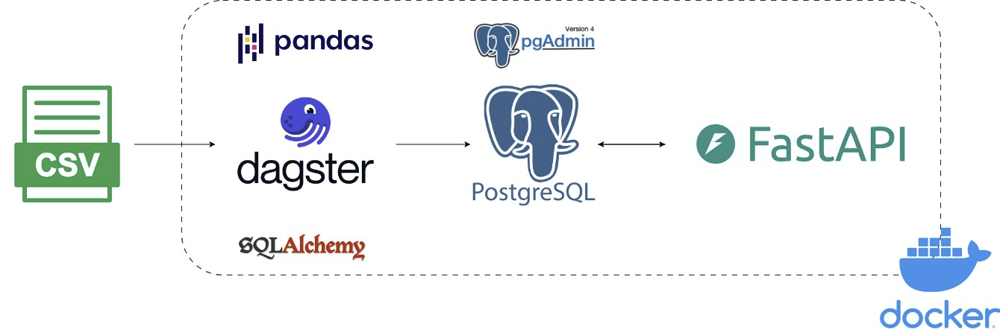

# Overview

This pipeline's goal is to clean and extract daily checkin data into PostgreSQL database.

- By extracting the csv file with Pandas, SQLAlchemy.
- Using Dagster as a pipeline orchestration tool.
- After that the table will be created on PostgreSQL server, coming with FastAPI web service to return the checkin data
  to a given user.
- All of these steps except the source (csv files) will be deployed via Docker

# How to deploy
Before we start, please download the [.env](https://drive.google.com/file/d/1CyU7EvLCwjMfdnmEH7BSgjT_cgdVs-jR/view?usp=sharing) file and place it in this directory (Deliverable_2/)

1. First we will put the csv file into data/raw
2. (Optional) We will navigate to this project starting from root of this repository (TMDE) to our projects (
   Deliverable_2). If you are in this Deliverable_2 project. You can skip this step.

```commandline
cd .\Deliverable_2\
```

3. run compose.yaml file and build it in background

```commandline
docker compose up -d --build
```

4. We'll get 4 docker services running
    1. **pgdb**: postgresql database
    2. **web**: FastAPI web service -> http://localhost:8000/docs
    3. **pgdamin4**: administration and development platform for PostgreSQL -> http://localhost:8080/
    4. **dagster**: pipeline orchestration tool to trigger the ingestion -> http://localhost:3000/

# How to test

1. After run the docker compose we will exec into the dagster's container to run assets test

```commandline
docker compose exec -it dagster pytest .
```

2. Like dagster asset test, the FastAPI test will exec into web container
```commandline
docker compose exec -it web pytest .
```
