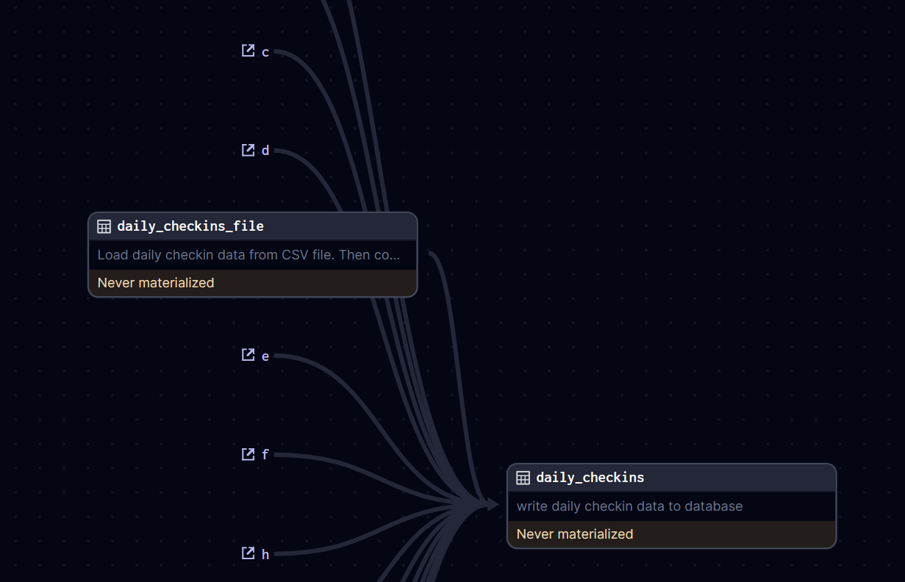

**Problems**

- Why default group is appear?
- Can't use EnvVar
- Dagster import path is invalid

# Overview

## Purpose

This pipeline's goal is to clean and extract daily checkin data into PostgreSQL database.
## Scope

## High-Level Architecture

## Key Components

# Diagram
