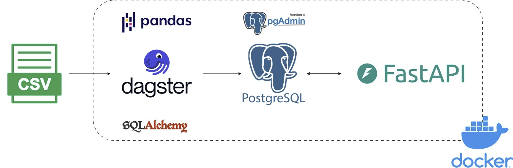

# Answer

### If the data is to be ingested periodically, what changes will you make to your current approach?

- Create job and schedule to trigger periodically. We might need to specify unique keys for upsertion also with adding
  create_at and update_at column
- Or create sensors to check if there's files at the source location. Ingest it and remove or back-up the file

### Draw a data architecture showing different components of your ETL process.



### How will you verify the correctness of the ingested data?

- Manually count using PostgreSQL to see if there's equal numbers of input and output.
- Create a unit test to check data type, datetime format.

---

# Overview

This pipeline's goal is to clean and extract daily checkin data into PostgreSQL database.

- By extracting the csv file with Pandas, SQLAlchemy.
- Using Dagster as a pipeline orchestration tool.
- After that the table will be created on PostgreSQL server, coming with FastAPI web service to return the checkin data
  to a given user.
- All of these steps except the source (csv files) will be deployed via Docker

# How to deploy

1. First we will put the csv file into data/raw
2. Activate virtual environment at root of this repository (TMDE)

```commandline
.venv ./Scripts/activate
```

3. (Optional) We will navigate to this project starting from root of this repository (TMDE) to our projects (
   Deliverable_2). If you are in this Deliverable_2 project. You can skip this step.

```commandline
cd .\Deliverable_2\
```

4. run compose.yaml file and build it in background

```commandline
docker compose up -d --build
```

5. We'll get 4 docker services running
    1. **pgdb**: postgresql database
    2. **web**: FastAPI web service -> http://localhost:8000/docs
    3. **pgdamin4**: administration and development platform for PostgreSQL -> http://localhost:8080/
    4. **dagster**: pipeline orchestration tool to trigger the ingestion -> http://localhost:3000/


# How to test

1. After run the docker compose we will exec into the dagster's container to run assets test
```commandline
docker compose exec -it dagster bash

cd Thinking_Machine_Project/tests

pytest
```
